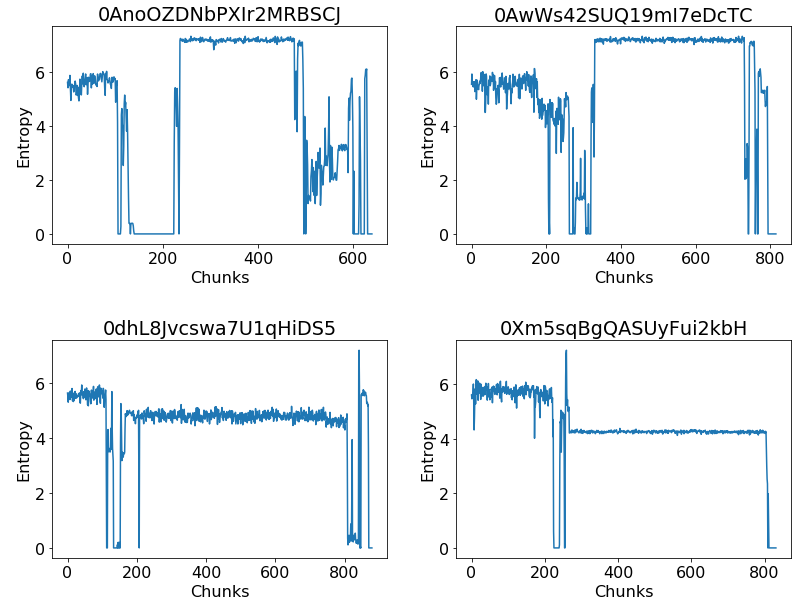

# Introduction
PE Extractor is a Python (3.6+) library and a set of command-line tools for preprocessing Portable Executable (PE) files. The 
goal of the library is to provide an intermediate representation of the PE files that allow for easy manipulation and 
feature engineering. The main features include:

- Preprocessing of Portable Executable files in hexadecimal format or its assembly language source code.
- Extraction of well-known features for malware detection and classification.
- Tools to visualize malware as grayscale images or its structural entropy representation.

## Visualization Tools
PE Extractor includes various command-line tools that can be used to visualize malware as:

- Grayscale images.
- Structural entropy. 

### Grayscale image representation of PE executables
Nataraj et al. [1] proposed to visualize and classify malware (in PE format) using image processing techniques. In their work,
binary executables are visualized as grayscale images, where every byte is reinterpreted as one pixel in the image.
Then, the resulting array is reorganized as a 2-D array and can be visualized as an image, with values ranging from 0 to 255.

This grayscale image representation can be used to classify malware as images of malware belonging to the same family are
similar between them while distinct from those belonging to other families as demonstrated in the work of Gibert et al. [2].

PE Extractor provides a command-line tool to convert and plot a PE file into a grayscale image:

    python plot_hex_grayscale_img.py data/0A32eTdBKayjCWhZqDOQ.bytes 0A32eTdBKayjCWhZqDOQ.png

In addition, one can use the library as follows to achieve the same result:
    
    from pe_parser.hexadecimal_parser import HexParser
    
    hex_parser = HexParser(pe_filepath)
    grayscale_img = hex_parser.convert_hex_values_to_img()
    plt.imshow(grayscale_img, cmap='gray', vmin=0, vmax=255)
### Structural entropy of PE executables

Similarly, a Portable Executable file can be visualized as a stream of entropy values, or structural entropy [3]. Entropy has long been
used to detect the presence of compressed and encrypted segments of code.  

Samples on the top of the image belong to the Ramnit family while those in the bottom belong to the Gatak family.

PE Extractor provides a command-line tool to convert and plot a PE file into a stream of entropy values:

    python plot_structural_entropy.py data/0A32eTdBKayjCWhZqDOQ.bytes 0A32eTdBKayjCWhZqDOQ.png --chunk_size 256

In addition, one can use the library as follows to achieve the same result:

    from pe_parser.hexadecimal_parser import HexParser
   
    hex_parser = HexParser(pe_filepath)
    hex_values = hex_parser.extract_hex_values()
    int_values = hex_parser.convert_hex_values_to_int(preprocess=False,hex_values=hex_values)
    structural_entropy = hex_parser.extract_structural_entropy(hex_values=int_values, chunk_size=256)

## Feature Extraction

The library provides two objects, HexParser and AssemblyParser, that allow for easy manipulation and feature extraction from the hexadecimal representation
of an executable's binary content and its assembly language source code

### HexParser

Apart from providing the methods required to visualize the executables as a stream of entropy values or as a grayscale image,
the HexParser provides various methods to extract the following features:

- Metadata features. 

- 1-Gram features.

- Entropy features.

- Haralick features.

- Local Binary Pattern features.

Example of usage:

    from pe_parser.hexadecimal_parser import HexParser
   
    hex_parser = HexParser(pe_filepath)
    hex_values = self.hexadecimal_parser.extract_hex_values()

    metadata_features = hex_parser.extract_byte_metadata_features()
    unigram_features = hex_parser.extract_byte_unigram_features(hex_values)
    entropy_features = hex_parser.extract_entropy_features(hex_values=hex_values)

    grayscale_img = hex_parser.convert_hex_values_to_img()
    haralick_features = hex_parser.calculate_haralick_features(grayscale_img)
    lbp_features = hex_parser.calculate_LBP_features(grayscale_img)

### AssemblyParser

Similarly, the AssemblyParser provides methods to extract the following set of features:

- Metadata features.

- 1-Gram features.

- Registers frequency features.

- Data define directives features.

- Symbols frequency features.

- Application Programming Interface (API) function calls.

- Pixel intensity features.

- Section features.

- Miscellaneous features.

Example of usage:

    from pe_parser.asm_parser import AssemblyParser

    asm_parser = AssemblyParser(filepath)
    metadata_features = self.asm_parser.extract_asm_metadata_features()
    symbol_features = self.asm_parser.extract_symbol_features()
    opcode_features = self.asm_parser.extract_opcode_unigram_features()
    register_features = self.asm_parser.extract_register_features()
    api_features = self.asm_parser.extract_API_features()
    misc_features = self.asm_parser.extract_MISC_features()
    section_features = self.asm_parser.extract_section_features()
    data_define_features = self.asm_parser.extract_data_define_features()
    
    asm_img = self.asm_parser.convert_asm_to_img()
    pixel_intensities = self.asm_parser.extract_pixel_intensities(num_pixels=800, asm_img=asm_img)

For a complete description of each feature category we refer the readers to [4] and the references therein.

## Assembly Language Source Code Intermediate Representation

In addition, the PE Extractor library can be used to generate an intermediate representation of the assembly language source 
code of a Portable Executable file. This representation consists of a list of x86Instr objects, each one representing an assembly statement.
 .text:00401000 56							       push    esi

An x86Instr object consists of 4 fields:

- The memory address associated to the instruction, e.g. 00401000
- The hexadecimal values associated to the instruction, e.g. 56
- The assembly language instruction, e.g. push esi
- The type of the instruction, e.g. x86Type.NORMAL. See x86_types.

Example of usage:

    from pe_parser.asm_parser import AssemblyParser

    asm_parser = AssemblyParser(filepath)
    source_code = self.asm_parser.extract_assembly_language_source_code()

  
# Citations

If you found this code useful, please don't forget to cite the following contributions:

- [1] L. Nataraj, S. Karthikeyan, G. Jacob, B. S. Manjunath, Malware images: Visualization and automatic classification, in: Proceedings of the
8th International Symposium on Visualization for Cyber Security, VizSec’11, Association for Computing Machinery, New York, NY, USA, 2011.
doi:10.1145/2016904.2016908.

- [2] Gibert, D., Mateu, C., Planes, J. et al. Using convolutional neural networks for classification of malware represented as images. J Comput Virol Hack Tech 15, 15–28 (2019). https://doi.org/10.1007/s11416-018-0323-0

- [3] Gibert, D., Mateu, C., Planes, J., & Vicens, R. (2018). Classification of Malware by Using Structural Entropy on Convolutional Neural Networks. Proceedings of the AAAI Conference on Artificial Intelligence, 32(1). Retrieved from https://ojs.aaai.org/index.php/AAAI/article/view/11409

- [4] Gibert, D., Chimera: bla bla bla